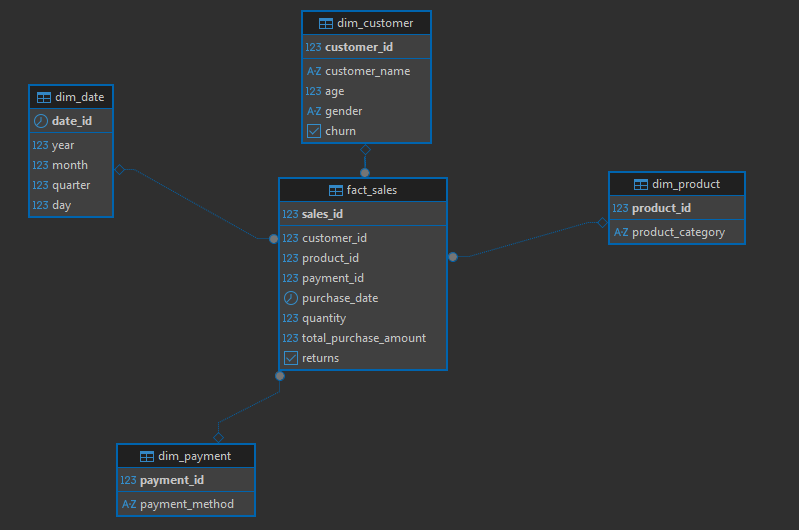
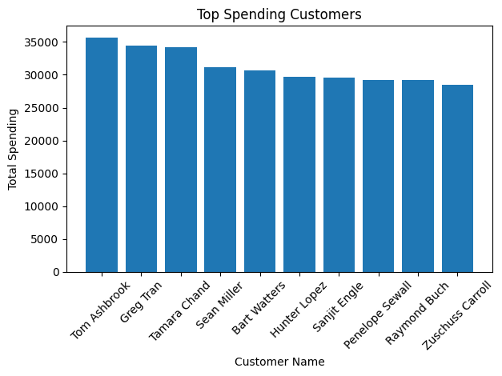
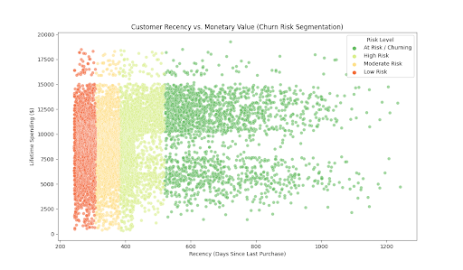
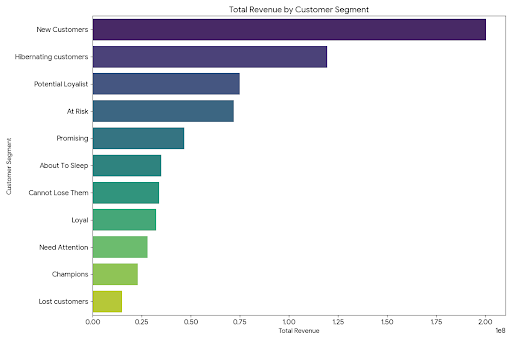
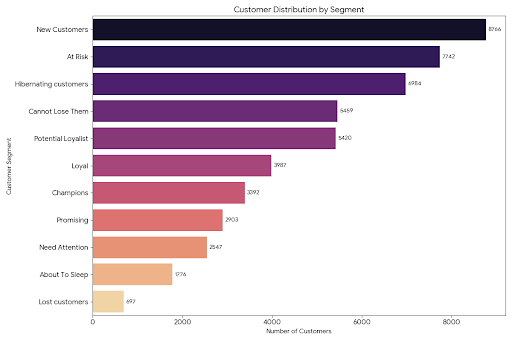
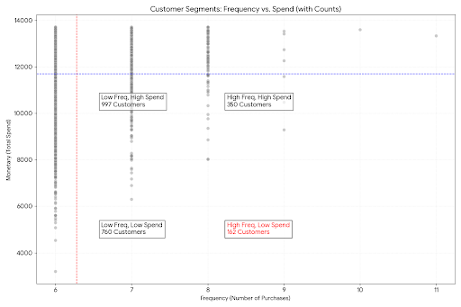

# Introduction
Customer retention and value optimization are critical success factors in the e-commerce industry. Understanding customer purchasing behaviour allows businesses to design targeted marketing strategies, improve engagement, and maximize revenue.

This project presents an end-to-end E-Commerce Data Mining (EDM) Analysis using RFM(Recency, Frequency, and Monetary) modeling to evaluate customer value and segment customers based on purchasing behaviour.

A structued PostgreSQL data warehouse was developed locally to transform the raw transactional data into actionable business insights.

The SQL queries are below here: [Project Folder](/Project/)

# Background and Methodology
## Data Warehouse Methodoly
This project follows an industry-standard analytics architecture:

Raw Dataset → Staging Layer → Data Warehouse → Analytics Layer → Business Insights

Three schemas were implemented:

- **staging schema**

- **warehouse schema**

- **analytics schema**

## Data Warehouse Architecture (Star Schema)
The data warehouse was modeled using a star schema design where a central fact table connects to multiple dimension tables to support analytical querying.

The schema consists of :

• *fact_sales* which is the transactional table

• *dim_customer* which describe customers information

• *dim_product* which describe the product details

• *dim_payment* which describe payment payment methods

• *dim_date* it enable time-based analysis

This modeling approach improves query performance and ensures scalable analytics reporting. Below is the Entity Relationship Diagram(ER Diagram)



## RFM Methodology
Customers were evaluated using three behavioural metrics:

- **Recency (R):** It's the number of days since the customer's last purchase

- **Frequency (F):** It refers to how often a customer makes purchases

- **Monetary (M):** It is how much a customer spends

Customers were scored using SQL window functions and mapped into business segments.

# Tools & Technology Used
**PostgreSQL:** It was used as the primary relational database management system for building the data warehouse. It enabled structured storage, schema creation, data modeling, and execution of advanced SQL queries required for RFM analysis and business intelligence reporting.

**DBeaver:** It serves as the database administration and query execution tool. It was used to connect to connect to PostgreSQL, create schemas and tables, run SQL scripts, manage relationships, and visualize the database structure through ER diagrams.

**Visual Studio Code (VS Code):** VS Code was used for project organization and documentation. SQL scripts, project folders, and documentation were managed within VS Code to maintain a clean and version-controlled analytics project structure.

**Git & GitHub:** It was used for version control and project hosting. It allows tracking of SQL scripts, documentation updates, and project history while serving as a public portfolio showing data engeering and analytics skills.

**Power BI:** It was used for data visualization and dashboard creation. Analytical views created in the analytics schema were connection to visualization tools to transform SQL outputs into interactive business insights for decision-making.

# Business Questions

1. Who are the top spending customers?
2. Which customers are at risk of churning?
3. Which customer segment generates the most revenue?
4. What is the distribution of customers across segments?
5. Which customers purchase frequently but spend less?

# Analysis
### 1. Top Spending Customers
Query: [project/top_spending_customer.sql](project\top_spending_customer.sql)

• Identifies the top spending customers

**Visualization:** 



**Key Findings**

- Tom Ashbrook is the highest-value customer, spending more than 35,000.

- 45% of this group has surpassed 30,000 lifetime spend mark

**Business Insight**

- Recommend a loyalty tier for these specific individuals to mitigate the high impact of potential churn.
- Data suggests this profiles are ideal for lookalike customers to lower customer acquisition costs.

### 2. Customers At Risk of Churning
Query: [project/customers_at_risk.sql](project/customers_at_risk.sql)

**Visualization**



**Key Findings**

- A significant group of customers has not made a purchase in over 500 days, putting them at high risk of being lost forever.

- The average customer stops engaging around the 380 day mark, which is the tipping point for churn.

**Business Insight**

- It is cheaper to win back a high spender customer (who already knows the brand) than to find a new customer. Send a "We Miss You" offer to everyone in the *At risk* category with a high lifetime spend.

- Set up an automated email alert when a customer hits 350 days without a purchase. Catching them before they hit the 380 day *tipping point* is the best way to prevent churn.

### 3. Customer Segment With The Most Revenue
Query: [project/revenue_by_customers.sql](project/revenue_by_customers.sql)

**Visualization**



**Key Findings**

- The New Customers segment is the powerhouse. It is not only the largest group but also the biggest revenue driver, bringing in over $200M.

- The Hibernating Customers is the second largest revenue source ($119M).

**Business Insight**

-  When a New Customer buys, give them a reason to buy again within 14 days.

- Send a "We want you back" offer. It is much cheaper to re-activate a hibernating customer than it is to pay for ads to find a brand new one.

### 4. Customers Distribution Across Segment
Query: [project/customer_distribution.sql](project/customer_distribution.sql)

**Visualization**



**Key Findings**

- New Customers are carrying the business. They represent the largest group (8,766 people) and also the biggest revenue source ($200.4M).
- The second largest group by count is the *At Risk* segment with 7,742 customers.

**Business Insight**

- Create a welcome loyalty program for the *New Customers* that rewards a second purchase within 30 days.
- For the *At Risk* customers, identify why they are leaving and send a feedback survey with a discount code to respark the relationship before they go cold.

### 5. Frequent Purchase But Low Spending Customers
Query: [project/frequent_low_spenders.sql](project/frequent_low_spenders.sql)

**Visualization**



**Key Findings**

- This customers has a high frequency but a monetary value that is significantly lower than the "Top Spenders".
- Unlike one-time big spenders, these customers have integrated your brand into their routine.

**Business Insight**

- Since their behaviour is already habitual, a recurring monthly fee for a discount locks their loyalty and stabilize cash flow.
- Since they already shop frequently, the goal is not to make them shop more often but to make them spend more per visit.

# Data Pipeline Overview
<div align="center">

```
CSV Dataset
↓
staging.e_commerce
↓
warehouse.dim_tables + warehouse.fact_sales
↓
analytics.customer_rfm
↓
analytics.customer_segment
↓
Business Analytics Views
↓
Visualization
```
<div align="left">

# Conculusion
This project demonstrates how raw transactional data can be transformed into meaningful customer intelligence using SQL-based analytics techniques.

By implementing RFM analysis within a structured data warehouse environment, the project enables businesses to:

- Identify high-value customers
- Detect potential churn risks
- Understand revenue-driving segment
- Support targeted marketing decisions
- Improve customer retention strategies

The analytical views created in the *analytics schema* provide reusable, production-ready business insight suitable for dashboard reporting and executive decision-making. 